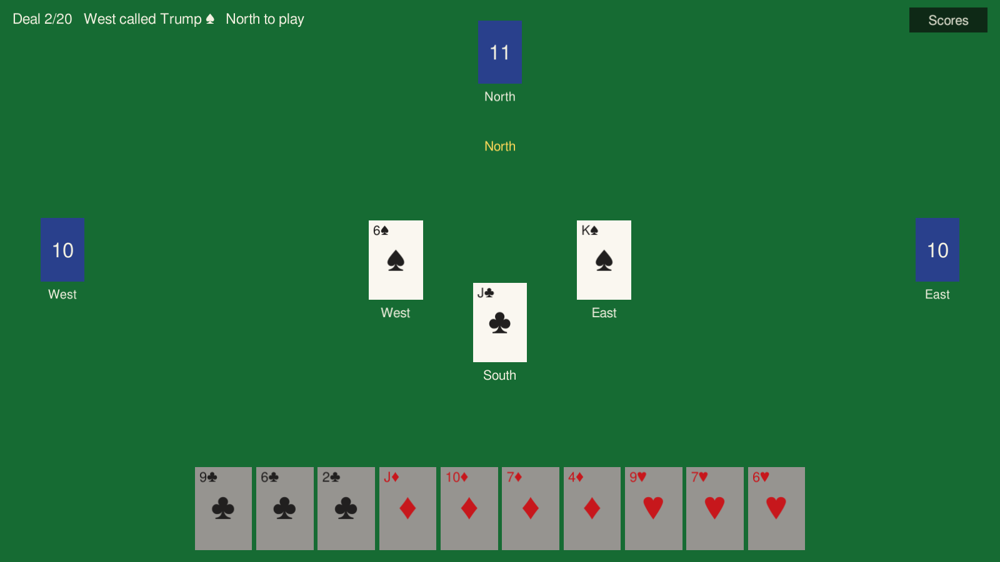
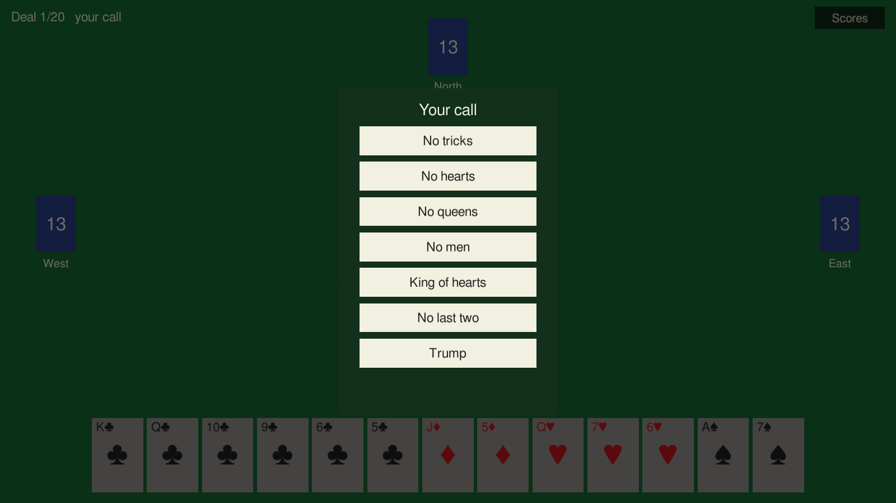
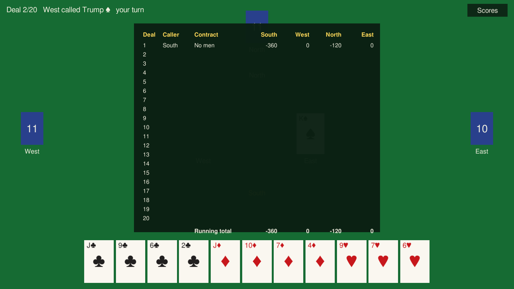

# Rifki

The Turkish trick-taking game, for one human and three machines. Built in Unity. Rıfkı is what it gets called at the table; in English the game is King, which is the name the code uses throughout.

<br clear="left">

## The game

King is a compendium game: twenty deals, and the player whose turn it is to call decides what each one is played for. There are six penalty contracts, where the goal is to *not* take things — tricks, hearts, queens, kings and jacks, the king of hearts, the last two tricks. Each gets called twice over the night, which accounts for twelve deals. The other eight are trump deals, two per player, where tricks finally score in your favour. So you spend part of the evening attacking and the rest dodging whatever your opponents picked to hurt you with.

Scores across a full session always sum to zero. Your win is, exactly, everyone else's loss.

The full rule set as implemented lives in [docs/rules.md](docs/rules.md).

## Layout

```
Assets/
  Scripts/
    Core/    rules engine: deck, contracts, trick resolution, scoring. Plain C#, no UnityEngine.
    AI/      the three computer seats. Also plain C#.
    UI/      table, hand display, trick area, scoreboard, contract picker.
  Scenes/
  Editor/    batchmode build entry points
  Tests/     edit-mode tests for the engine
dev/         thin dotnet harness so engine tests run without the editor
docs/        rules writeup
```

## Running it

Built with Unity 6000.0.80f1 (Unity 6 LTS). Open the repo folder in the editor, load `Assets/Scenes/Main.unity`, hit play. You're South; the other three seats play themselves.

The rules engine and AI don't touch UnityEngine at all, so their tests also run from the command line:

```
cd dev && dotnet test
```

Handy when you want to check a rules change without waiting for the editor.

There's also `dev/uicheck.sh`, which compiles the UI and editor scripts against a real Unity install without opening the editor. `dotnet test` only covers Core and AI, so nothing else catches a mistyped UnityEngine call until a full build:

```
UNITY=/path/to/Unity-6000.0.80f1 dev/uicheck.sh
```

Building from the command line, one method per platform:

```
Unity -batchmode -quit -nographics -projectPath . \
      -buildTarget Linux64 \
      -executeMethod King.EditorTools.BuildCommands.LinuxDesktop
```

Swap in `WebGL`, `MacDesktop`, `WindowsDesktop` or `Android` for the other targets. Builds land in `build/<platform>/`. One warning from experience: import the project once on its own before asking for a build, because a cold project resolves its packages and compiles the player in the same pass and the assembly references come out wrong.

## Gameplay

Mid-deal, in the desktop build. West called spades as trump, South led a club and is out of trumps so the jack is just a discard, and North is on the clock:



The caller picks the contract with their cards already on the table, since choosing blind would be a coin toss. Whatever is out of quota is greyed out:



Scores go on a twenty-row sheet with a running total. Deal one here was no men: South collected six of the eight kings and jacks, North picked up two, and the row sums to -480 like it has to:



## CI and builds

Every push to main and every pull request runs the engine tests on a plain ubuntu runner with dotnet 8. That job needs no setup at all, and everything else hangs off it: if the rules engine is broken, nothing gets built and nothing gets deployed.

The rest of the pipeline builds the actual game. WebGL, macOS, Windows and Android each come out as a downloadable artifact, and the WebGL build goes up to GitHub Pages at https://naltinbas.github.io/Rifki/. Those jobs need a Unity license, so they check for the license secrets first and quietly skip when they're missing. Nothing fails, the tests still run, you just don't get builds.

That link is dark at the moment. Pages is configured and waiting, but nothing has deployed to it yet, so don't expect the demo to load until a build with a license actually runs.

To light the builds up:

1. Get a Unity license file. Easiest route is game-ci's activation flow: run their [unity-request-activation-file workflow](https://game.ci/docs/github/activation) (or `game-ci/unity-request-activation-file` locally), upload the `.alf` at license.unity3d.com, and you get a `.ulf` back. Personal licenses work fine.
2. In the repo settings, add three Actions secrets: `UNITY_LICENSE` (the full contents of the `.ulf` file), `UNITY_EMAIL` and `UNITY_PASSWORD` (the Unity account it belongs to).
3. Make sure Pages is set to deploy from GitHub Actions (Settings → Pages → Source → GitHub Actions). This repo already has that flipped via the API, so normally there's nothing to do here.

Next push to main after that runs editmode tests inside the editor, builds all four platforms, and the Pages link goes live.
